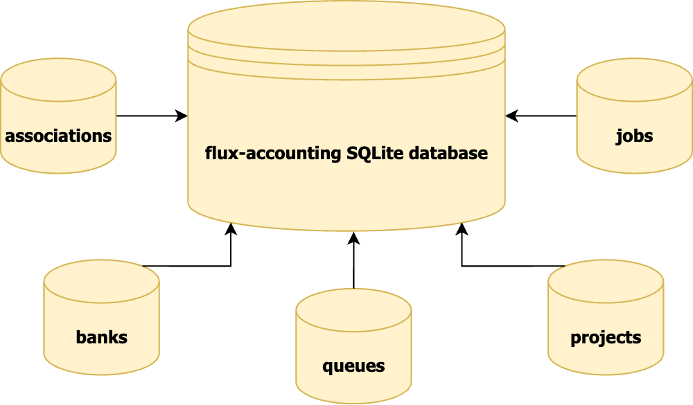
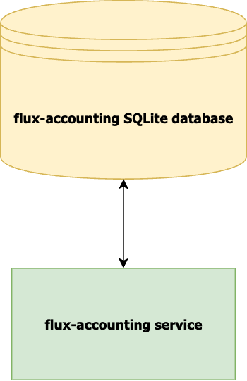
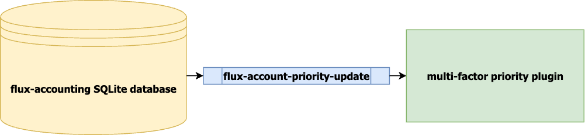
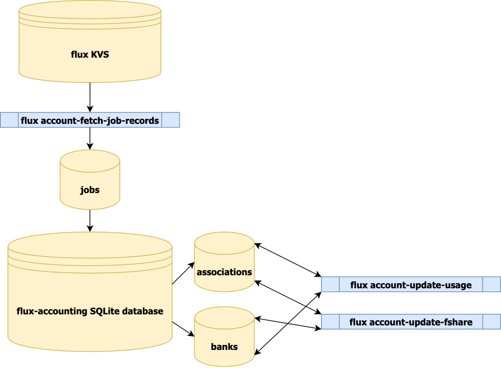

.. _module-structure:

################################
Flux Accounting Module Structure
################################

The flux-accounting module is made up of a number of components that work
together to provide an accounting interface for a system instance of Flux.
This section describes the different pieces that make up the module and how
they interface with each other.

flux-accounting database
========================

The flux-accounting SQLite database is the central hub for all information
pertaining to how the module interfaces with the rest of Flux. It stores
association, bank, queue, project, and historical job information in order to
manage groups, track job usage over time, and set various accounting policies
that can administer a cluster in an equitable and customizable way.

This database can be interfaced with both directly in a SQLite shell (granted
you have read/write permissions to the directory that the database resides in)
*or* via the flux-accounting service, a service run with ``systemctl`` that
accepts ``flux account`` commands to view, edit, or add new information
pertaining to flux-accounting.

multi-factor priority plugin
============================

flux-accounting calculates job priorities and enforces limits for a Flux system
instance via jobtap plugin. The multi-factor priority plugin gets periodic
updates from the flux-accounting database when associations, banks, queues,
and/or projects are added or modified with the ``flux account-priority-update``
command.

job usage/fair-share updates
============================

As jobs are run, flux-accounting will query the `Flux KVS`_ to fetch completed
jobs and store them in the ``jobs`` table in order to calculate job usage
values for associations and the banks they belong to.
``flux account-update-usage`` will walk through each association and bank and
calculate new job usage values as well as apply a decay value to older jobs.
``flux account-update-fshare`` will perform the same traversal and subsequently
update each association's fair-share value.

.. _Flux KVS: https://flux-framework.readthedocs.io/en/latest/quickstart.html#flux-kvs
